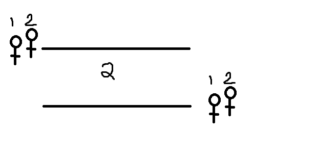
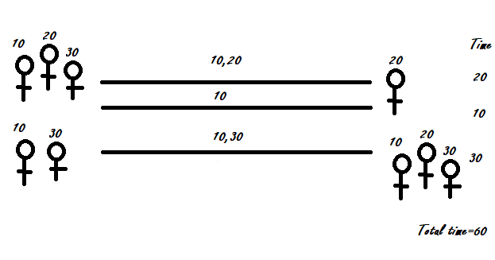
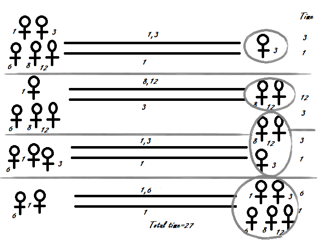

##Given an array of positive distinct integer denoting the crossing time of ‘n’ people. These ‘n’ people are standing at one side of bridge. Bridge can hold at max two people at a time. When two people cross the bridge, they should have a light torch at all times. There is only one light torch. Find the minimum total time in which all persons can cross the bridge.

> given array: {1,2,50,75,100,150,200}

> two people would have to travel to the other side and make sure one comes back and if fastest comes back that would count time as less

> The time taken by two people would be the time of the slowest among two since the fastest person has to match the speed with slowest

> Lets keep 2 sides one the dangerous side and the other the safe side. The minimum time is taken when people in dangerous has less time to wait for

> that is there should always be atleast one fastest candidates on the other dangerous side to make sure he comes back with less time to hand out the torch.

> sort the array first to array ordered in terms of speed

> so for n<3 there would be only 2 people or less and they can directly travel to safe side and would not have to return so a[n-1] The shlowest time would be total time
> 

> for n==3 all of the peoples speed would count
> 

> for n>3 we see a pattern a[1],a[0],a[n-1],a[1] time taken for a sorted sequence and we calculate time based on this pattern and use recursion for the same.
> 

```java
public static int fun(int a[],int n)
{
    int result=0;
    if(n<3){
        result=a[n-1];
    }
    else if(n==3){
        result=a[0]+a[1]+a[2];
    }
    else{
        result+=a[1]+a[0]+a[n-1]+a[1]+fun(a,n-2);
    }
    return result;
}
```

###The time complexity would be O(n) with O(1) space complexity
